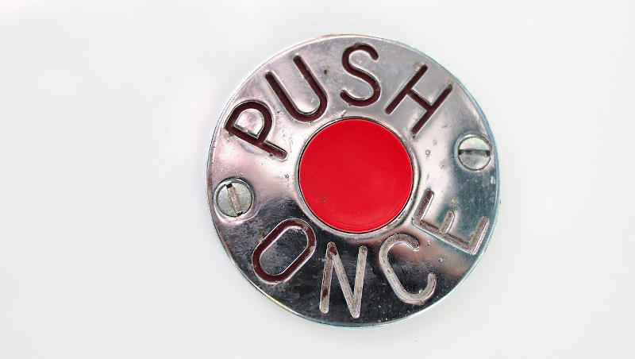

Often there is the requirement to push data updates from the server to the client-side. Imagine a chat app
showing incoming messages in the client's browser. New messages should get displayed automatically without polling,
the user shouldn't need to trigger some action to fetch new messages.
In general UI push updates (https://vaadin.com/docs/v15/flow/advanced/tutorial-push-access.html) are pretty easy to
implement with Vaadin by default, but there are some special cases we have to deal with.

In this article I want to show you a way to achieve asynchronous UI updates with Vaadin without data flooding or overloading
the server to client connection when many concurrent push requests arrive. In addition, if you use Spring Security with Vaadin,
we probably want to have access to the user's security context to authorize push updates before they get dispatched
to the client's browser.

<!--more-->

First, let me describe the environment of one of my larger projects my colleagues and I working on.
I think this project is a good production example for server-to-client push. We use Apache Kafka as
centralized event streaming platform. The whole truth is stored in Kafka in form of domain events.
We have a few self-contained services (SCS) powered by Vaadin and Spring Boot. For example, when
a stream listener of some SCS consumes a domain event the users get notified immediately about the
data change via server push.



Let's concentrate on the important part. Imagine each inbound event would trigger an asynchronous UI update.
What do you think happens if many events get consumed concurrently (> 1.000)? - In the best case this causes an unnecessary high server and
client/browser load, in the worst case our app is going to crash. In event-driven architectures it's common to deal with a huge amount of
messages/events.

For Vaadin 14+ there is no existing solution for this problem as I know. Conventional event busses like Guava aren't going to help here,
because they don't offer buffering or security context awareness out-of-the-box. 

### Buffering

> Buffering (http://reactivex.io/documentation/operators/buffer.html): periodically gather items emitted by an Observable into bundles
>and emit these bundles rather than emitting the items one at a time

To avoid triggering a UI update for each inbound domain event one could use buffering. So we introduced a simple class called
`UiAwareBufferingEventDispatcher`. Our event dispatcher collects all incoming events within a defined time span. Then it emits *just one*
event containg a list of all collected events to the consuming Vaadin components:



The consuming component can decide on how to handle the buffered events. For example if the component should trigger a simple
user notification - like "New data available" - just the last buffered event in the list will be sufficient most of the time. It depends on the use
case if none, one, multiple or all events are interesting for the component/view.

Under the hood we use RxKotlin (https://github.com/ReactiveX/RxKotlin) for buffering, a great library for reactive programming:


class UiAwareBufferingEventDispatcher(...) {
    ...
    
    companion object {
        private const val BUFFER_TIMESPAN_IN_MILLIS: Long = 500L
    }
        
    private val subject = PublishSubject.create<Any>()
    private val scheduler = Schedulers.from(Executors.newSingleThreadExecutor())
    private var subscriber: Disposable? = null
    
    @PostConstruct
    fun postConstruct() {
        subscribe()
    }
    
    /** dispatch event (Note: runs in caller thread) */
    fun dispatch(event: Any) {
        subject.onNext(event)
    }
    
    /** start internal subscription to subject (events, which will be dispatched) */
    private fun subscribe() {
        if (subscriber == null || subscriber!!.isDisposed) {
            subscriber = subject.observeOn(scheduler)
                .buffer(BUFFER_TIMESPAN_IN_MILLIS, TimeUnit.MILLISECONDS)
                .subscribe {
                    // dispatches the buffered events to Vaadin components
                    this.dispatchToHandlers(it)
                }
        }
    }
    ...
}


I have published a demo project containing the full code on GitHub:

* https://github.com/ajgassner/vaadin-playground/tree/master/buffering-event-dispatcher
* [UiAwareBufferingEventDispatcher.kt](https://github.com/ajgassner/vaadin-playground/blob/master/buffering-event-dispatcher/src/main/kotlin/at/agsolutions/demo/UiAwareBufferingEventDispatcher.kt)

### Spring's SecurityContext awareness

Following snippet shows a sample consuming view/component. When an event arrives the session's security context
is available in the async handler.


@Push
@Route("")
class MainView(
    private val dispatcher: UiAwareBufferingEventDispatcher
) : VerticalLayout() {
    ...
    override fun onAttach(event: AttachEvent) {
        dispatcher.register(this, MessagePostedEvent::class) { bufferedEvents ->
            // following code doesn't run in component's thread,
            // but the SecurityContext is available!
            val username = SecurityUtils.user?.username ?: "unknown"
            val lastEvent = bufferedEvents.last()
            add(Span("ID: ${lastEvent.id}, Username: $username"))
        }
    }

    override fun onDetach(event: DetachEvent) {
        // do not forget to unregister the consumer!
        dispatcher.unregister(this)
    }
    ...
}


The event dispatcher is able to access the component's underlying HTTP session and
sets the thread-bound SecurityContext before the handler gets executed:


@Service
class UiAwareBufferingEventDispatcher(
    @Qualifier("uiTaskExecutor") val taskExecutor: AsyncTaskExecutor
) {
    ...
   /**
     * Sends a list of buffered events to registered handlers and synchronizes call to
     * view state with session bound security context. Runs within TaskExecutor Thread.
     * In case the view isn't bound to a UI or session this call ends
     * without any exception. (handlers should only update UI and must not trigger any
     * business logic)
     */
    private fun dispatchWithinUIContext(
        view: Component, handler: (List<*>) -> Unit,
        events: List<*>
    ) {
        val ui = view.ui.orElse(null) ?: return
        val vaadinSession = ui.session ?: return
        val httpSession = vaadinSession.session ?: return

        val sessionSecurityContext = httpSession.getAttribute(
            HttpSessionSecurityContextRepository.SPRING_SECURITY_CONTEXT_KEY)
        val securityContextToUse = if (sessionSecurityContext is SecurityContext) {
            sessionSecurityContext
        } else {
            SecurityContextHolder.createEmptyContext()
        }

        ui.access {
            val origCtx = SecurityContextHolder.getContext()
            try {
                SecurityContextHolder.setContext(securityContextToUse)
                handler(events)
            } catch (e: UIDetachedException) {
                // ignore exceptions (just UI updates)
            } catch (e: Exception) {
                logger().error(
                    "unexpected exception while handling events {} bound to view {}",
                    events,
                    view,
                    e
                )
            } finally {
                SecurityContextHolder.setContext(origCtx)
            }
        }
    }
    ...
}


I hope you can benefit a bit from this blog post. The code is MIT-licensed, so feel free to use
it in your projects!
