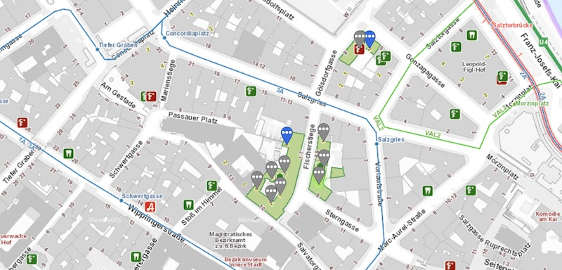

Recently I had to transform ViennaGIS Gauß-Krüger M 34 MGI Austria GK East coordinates to Google WGS84 using EPSG code 31256.
The use case was to show pins on Google Maps or Leaflet of ViennaGIS provided objects and locations.

<!--more-->

Unfortunately ViennaGIS (https://www.wien.gv.at/viennagis/) uses a Gauß-Krüger M 34 projection which cannot be used with
most other map SDKs. So I had to transform the coordinates to Google's coordinate system beforehand.
I used proj4j (https://github.com/locationtech/proj4j) and proj4js (https://github.com/proj4js/proj4js) libraries which are ports for Java and JavaScript of the proj library (https://proj.org/).
Following code shows how to transform ViennaGIS GK34 to WGS84 with Kotlin or JavaScript:


